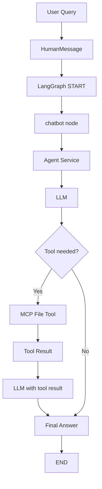

# AI Software Engineer

This project is a lightweight agentic LLM application that can answer questions and interact with the local filesystem through MCP tools. It uses LangGraph for orchestration, LangChain for LLM integration, and a filesystem MCP server for file operations.

## What this project does

The assistant can:
- answer general questions
- create files
- read files
- write content to files
- delete files

It is designed as a simple but practical example of an agentic workflow where the LLM can decide whether it needs to use tools before answering.

## Architecture overview

The system is composed of four main layers:

1. User interface layer
   - The terminal app collects the user's query.

2. LangGraph orchestration layer
   - A single-node graph routes the conversation through the chatbot node.

3. Agent layer
   - The agent orchestrator sends the conversation to the LLM.
   - If the LLM requests a tool, the agent executes it.
   - The tool result is sent back to the LLM for the final response.

4. Tool/MCP layer
   - The filesystem server exposes tools such as create, read, write, and delete.
   - The MCP manager connects the agent to that server.

## End-to-end flow

From a user's query to a final response, the flow is:

1. The user enters a prompt in the terminal.
2. The prompt is wrapped as a HumanMessage.
3. LangGraph starts the chatbot node.
4. The agent sends the message to the LLM.
5. The LLM decides whether a tool is needed.
6. If needed, the agent calls the MCP filesystem tool.
7. The result from the tool is returned to the LLM.
8. The LLM produces the final answer.
9. The answer is printed back to the user.

## Project structure

- app.py
  - Entry point for the interactive CLI.
- graph/
  - LangGraph state, graph builder, and node definitions.
- services/
  - LLM service, agent orchestration, MCP service, and tool loading.
- mcp_client/
  - MCP client manager for connecting to the filesystem server.
- servers/filesystem/
  - MCP filesystem server and file operation implementations.
- prompts/
  - System prompt used to guide the LLM.
- workspace/
  - Default folder where created files are stored.

## LangGraph flow graph



## Runtime behavior

The assistant works best when the user asks for tasks such as:
- “Create a file named notes.txt”
- “Write this content to report.md”
- “Read the file demo.txt”
- “Delete the file temp.txt”

The model decides whether to answer directly or call a filesystem tool.

## Setup

1. Create and activate a virtual environment.
2. Install dependencies from requirements.txt.
3. Create a .env file with your NVIDIA API key.
4. Run the app:

```bash
python app.py
```

## Notes

This project is a solid starting point for an agentic coding assistant. It demonstrates:
- tool calling
- external tool integration
- LangGraph-based orchestration
- file manipulation through MCP

It can be extended to support more tools such as:
- code search
- git operations
- terminal execution
- test running
- multi-file editing
